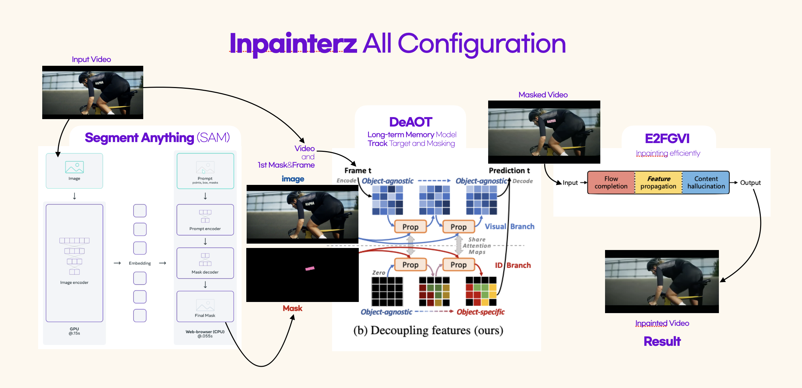
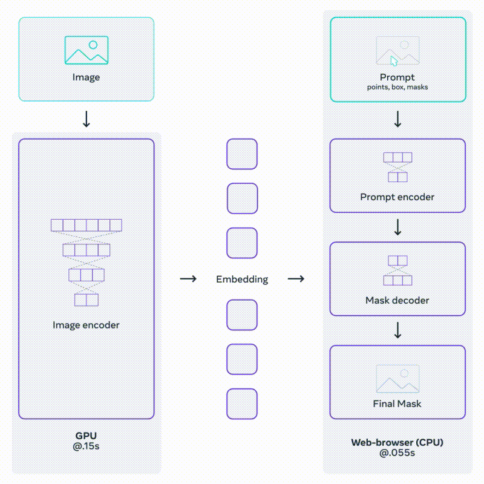
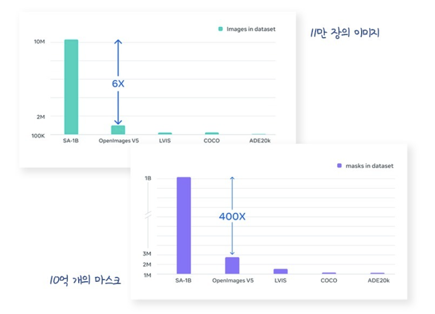
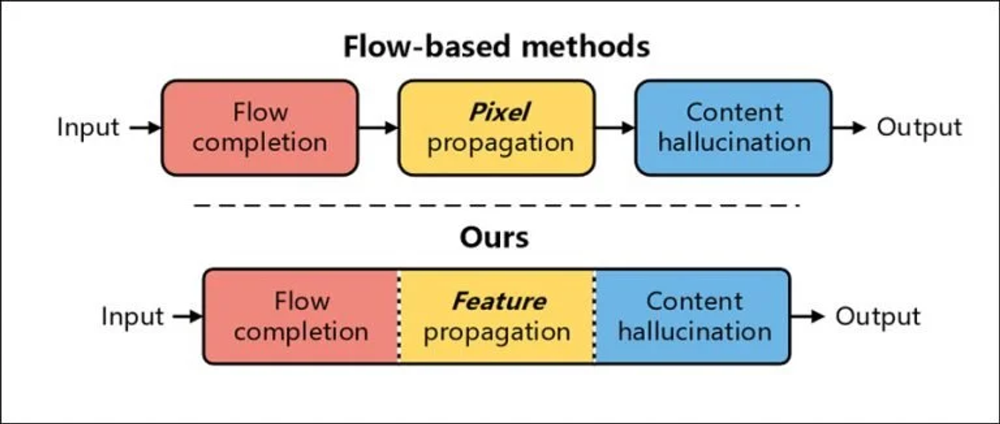

# Inpainterz
-------------------------------
Online Demo:[](https://drive.google.com/file/d/1cQLFl2z5iOI9iZDcn4hSZ4zMU7bUu9NX/view?usp=sharing), Project presentation: (team ppt)


**Inpainterz**는 2023년 이어드림스쿨3기에서 진행된 기업연계 프로젝트입니다. 
**연계기업**으로부터 **인페인팅기술**에 대한 **선행연구개발** 주제를 받아 진행하였습니다.

🚀 Team Members
> [강도성](https://github.com/kang952175) 
> [경소현](https://github.com/SohyeonGyeong) 
> [변웅진](https://github.com/1ncarnati0n)
> [손수진](https://github.com/Soosembly)
> [지경호](https://github.com/zkhshub)

그 결과를 오픈소스 프로젝트로 정리했습니다. 


주요 알고리즘으로는 제로샷 러닝 및 비젼에서의 파운데이션 모델로 선보인 Meta의 [**SAM**(Segment Anything Models)](https://github.com/facebookresearch/segment-anything) 과 효율적인 Multi-Object Track 그리고 Propagation를 위한 [**DeAOT**(Decoupling features in Associating Objects with Transformers)](https://github.com/yoxu515/aot-benchmark)(NeurIPS2022)그리고 [**E2FGVI** (End-to-End Framework for Flow-Guided Video Inpainting)](https://github.com/MCG-NKU/E2FGVI) 으로 인페인팅을 하는 Workflow이며 gradio를 이용해 GUI를 구성하였습니다.


🎥 비디오를 인페인팅 하는 과정은 다음과 같이 정리할 수 있습니다.

**1. *동영상 마스킹***
   **Segmentation** & **Masking**
   동영상에서 인페인팅 할 객체를 선택하고 정확하게 판별(분리)하기 위해, Segmentation 기법을 사용. 
   해당 부분이 누락된 것처럼 분할된 객체를 Masking하여, 인페인팅 알고리즘이 수행할 수 있게 한다. 
   **Tracking**, use **Long-term Memory**
   Long-term Memory으로 Masking된 객체가 특정 프레임 내에서 따라 움직이는 것을 연속적으로 Tracking & Masking을 수행하여 동영상 내에 모든 마스킹 이미지를 추출한다. 
   
**2. *동영상 인페인팅***
   **Inpainting**
   Input 값으로 Masking된 영상을 넣으면 복원 해야하는 누락된 지점으로 인식한다. 이 과정에서 알고리즘은 주변의 픽셀 정보로 누락된 부분의 색상과 텍스쳐 등을 추정하고 채운다. 

**3. *결과 확인 및 수정***
   Inpainting된 결과를 확인하고, 품질을 향상 시키기 위해 추가적인 Task를 수행한다.


🎥 **inpainterz의 파이프라인**은 **SAM**이 새로운 오브젝트를 동적으로 자동감지하고 세분화할 수 있도록 지원하며, **DeAOT**는 식별된 모든 오브젝트를 추적하는 역할을 담당합니다. 결과적으로 **E2FGVI**는 추적되어 마스킹된 비디오 영상들을 인페인팅 합니다. 

<p align="center">

</p>


## **Summary** of the algorithms used
---------
**inpainterz**에서 사용한 알고리즘에 대한 내용을 요약했습니다. 
### SAM 
(Segment Anything Model) **[Paper](https://ai.meta.com/research/publications/segment-anything/)**

대규모 데이터셋이 구축되지 않았던 기존의 Segmentation 작업은 매번 학습에 소모되는 시간과 비용이 너무 크다는 문제가 있었습니다. NLP 분야의 LLM처럼, **Zero-shot**이 가능한 모델을 만들수 없을까 했고, 2023년 4월 Meta에서는 Image Segmentation계의 **Foundation** 모델을 만드는 것을 목표로 이 모델을 발표했습니다.

Meta는 다음 세 가지를 새롭게 선보였습니다. **Task**, **Model**, **Data**.
1. **Task** ( Promptable Segmentation Task )
	Segment Anything Task의 핵심은 **프롬프팅이 가능**하다는 것.
	원하는 영역의 **Point**나 **Box** 또는 **자연어**, (+ **Mask**)로 구성된 프롬프트를 입력하면, 아무리 모호한 정보일지라도 유효한 Segmentation Mask를 출력한다.
	<p align="center">
	
	</p>
2. **Model** ( Segment Anything Model, SAM )
	이를 위한 모델인 SAM은 **두 개의 인코더**와 **하나의 디코더**로 구성.
	Image Encoder와 Prompt Encoder로부터 온 임베딩 정보를 매핑해 Mask Decoder가 예측된 Segmentation Mask를 출력하는 구조다. 
	
	Mask Decoder는 Transformer의 Decoder를 조금 수정한 것으로, 이미지 임베딩과 프롬프트 임베딩을 모두 업데이트 하기 위해 **Self-Attention**과 **Cross-Attention**을 양방향으로 활용한다.
	
	SAM의 Prompt Encoder와 Mask Decoder는 **가볍고 빠르다**.
	같은 이미지 임베딩이 여러 개의 프롬프트와 함께 재사용되기 때문에, CPU 환경의 웹 상에서 50ms 이하의 속도로 Mask를 예측할 수 있다.
	<p align="center">	
	
	</p>

3. **Data** ( Segment Anythin Data Engine, SA-1B Dataset )
	Foundation 모델 개발에 있어 가장 중요한 것은 대규모 데이터셋이다.
	Segment Anything은 자체적인 **Data Engine**을 개발했고, 그 결과 10억 개의 Mask를 가진 **SA-1B** 데이터셋이 탄생했다.
	<p align="center">
	
	</p>

### DeAOT
(Decoupling features in Associating Objects with Transformers) [**Paper**](https://arxiv.org/abs/2210.09782)

기존의 AOT 방법을 개선하여, 객체에 구애받지 않는 시각적, 객체별 특징을 독립적인 두 분기에서 처리, Dual independent branches propagation를 위한 효율적인 모듈인 Gated Propagation Module (GPM)을 도입하여 hierarchical propagation을 구성합니다​​.

1. **VOS의 정의와 배경**
	VOS는 주어진 비디오에서 하나 또는 여러 객체를 인식하고 분할하는 중요한 비디오 이해 작업입니다. 이 연구는 알고리즘이 초기 프레임에서 주어진 객체의 마스크를 기반으로 전체 비디오 시퀀스에 걸쳐 객체를 추적하고 분할해야 하는 반감독 VOS에 중점을 둡니다​​.

2. **DeAOT의 주요 구성**
	DeAOT는 두 가지 분기, 즉 시각적 분기와 ID 분기로 구성. 시각적 분기는 객체를 일치시키고 과거의 시각 정보를 수집하며 객체 특징을 정제하는 역할. ID 분기는 시각적 분기에서 계산된 일치 맵(attention map)을 재사용하여 과거 프레임에서 현재 프레임으로 ID 임베딩을 전파​​.

3. **Gated Propagation Module (GPM)**: DeAOT에서는 효율성을 높이기 위해 Single Head attention을 기반으로 설계된 GPM을 사용합니다. GPM은 자체전파, 장기전파, 단기전파의 세 가지 종류의 게이트 전파를 포함.

4. **네트워크 세부사항, 트레이닝**
   DeAOT는 다양한 인코더와 동일한 FPN 디코더를 사용합니다. GPM 모듈은 시각적 및 ID 임베딩의 차원을 지정하고, 학습은 정적 이미지 데이터셋에서 생성된 합성 비디오 시퀀스와 VOS 벤치마크에서 수행됩니다​​.

5. **결론**: 
   DeAOT는 계층적 VOS 전파를 위한 효율적인 프레임워크를 제공. 이는 계층적 전파에서 시각적 및 ID 임베딩을 분리하여 깊은 전파계층에서의 시각 정보 손실을 방지.


### E2FGVI
(End-to-End Framework for Flow-Guided Video Inpainting) [**Paper**](https://arxiv.org/abs/2204.02663)

**비디오 인페인팅**
목표는 비디오 클립 전체에서 ‘손상된’ 영역을 그럴듯하고 일관된 콘텐츠로 채우는 것, 하지만 남은 과제로 복잡한 비디오 시나리오와 저하된 비디오 프레임에 관한 문제가 있으며. 이는 고품질 비디오 인페인팅을 위해서는 **공간적 구조**와 **시간적 일관성**을 모두 고려해야 함을 의합니다.

**Flow-based methods** (기존 방법)
- 이런 일반적인 흐름기반 방법(flow-based method)는 인페인팅을 **pixel propagation** 문제로 생각하여 시간적 일관성을 자연스럽게 보존

1. flow completion : 
   손상된 영역에 flow field가 없으면 후자의 프로세스에 영향을 미치므로 먼저 추정된 optical flow가 먼저 완료 되어야 한다
2. pixel propagation : 
   앞서 완성된 optical flow의 가이드에 따라 가시영역의 픽셀을 양방향으로 전파, 손상된 비디오 영역을 채움 
3. content hallucination : 
   픽셀 전파 후, 나머지 누락된 영역은 사전 학습된 이미지 인페인팅 네트워크로 환각으로 채움

-  인페인팅의 방법은 전체 인페인팅 파이프라인을 구성하기 위해 개별적으로 적용, 인상적인 결과를 얻을 수 있지만, 처음 두 단계에서는 많은 수작업이 필요해서, **각 프로세스는 별도로 수행**해야 하는 **단점**이 있다.

- 따라서, 두 가지 주요한 문제를 야기한다.
    a. **이전 단계에서 발생한 오류가** 누적 후속 단계에서 증폭, **최종 성능에 큰 영향을 미침**
    b. **복잡한 연산**을 해야하지만, GPU acceleration 처리불가, **많은 시간이 소요**

	<p align="center">	
	
	</p>

**E2FGVI** (개선된 모델 Fig. Ours, ) 
- 이전 모델을 보완, 이전 방법과 다르게 **End-to-End**로 최적화 할 수 있어 보다 효율적이고 효과적인 인페인팅 프로세스 구현 가능

1. **Flow-Completion** 모듈: 
   복잡한 단계 대신 원-스텝 완성을 위해 마스킹 된 비디오에 직접 적용
2. **Feature Propagation** 모듈: 
   pixel-level propagation과 달리, flow-guided propagation 프로세스는 (변형이 가능한 convolution의 도움을 받아서) feature space 수행됨. 
   → 학습 가능한 sampling offset과 feature-level 연산 통해 **정확하지 않은 flow추정 부담을 덜어줌**
3. **Content Hallucination** 모듈: 
   공간과 시간적 차원에서 장거리 종속성을 효과적으로 모델링하기 위해 temporal focal transformer를 제안.
   →이 모듈에서 local and non-local temporal neighbors을 모두 고려, **보다 시간적으로 일관된 인페인팅 결과** 도출

- 70개의 프레임 기준으로 이 크기의 비디오 하나를 완성하는 데에 약 4분 소요. E2FGVI는 프레임당 0.12초로 약 8.4초 소요.


## Inpainterz Project Review

### 구성한 App의 한계점
- 빠르게 움직이는 대상과 대상에 간섭이 지속적으로 이루어지는 경우 memory를 놓친다. (e.g. 댄스 영상)
- 경계가 뚜렷하지 않은 객체(벽의 균열)등을 inpainting하고자 하는 경우 잘 동작되지 않다.

### 회고 및 개선가능한 방향들
- 이미지의 첫 단에 등장하는 객체가 아닌 중간이나 끝에 삽입되는 객체를 기억하는 알고리즘이다.
- SOTA inpainting 알고리즘을 적용하여 더 자연스러운 객체 제거할 수 있다.


## 🎮 Getting Started
-----
**1. Conda Default Environment**

```shell
pip install torch==1.11.0+cu113 torchvision==0.12.0+cu113 torchaudio==0.11.0 --extra-index-url https://download.pytorch.org/whl/cu113
pip install mmcv-full==1.4.8 -f https://download.openmmlab.com/mmcv/dist/cu113/torch1.11/index.html
bash script/install.sh
pip install gradio==3.39
pip install av
pip install gdown
```

**2. Requirements**
- The Segment-Anything repository has been cloned and renamed as sam, and the aot benchmark repository has been cloned and renamed as aot.

- Please check the dependency requirements in SAM and DeAOT and E2FGVI.

- The *implementation is tested under **python 3.9***, as well as ***pytorch 1.11.0*** + ***cu113*** and torchvision 0.12.0 + cu113 We recommend equivalent or higher pytorch version.
  
-  Use the install.sh to install the necessary libs for **Inpainterz**
```
bash script/install.sh
```

⭐ **3. Model Preparation**
- Download **SAM** model to **ckpt**, the default model is SAM-VIT-B (sam_vit_b_01ec64.pth).
  
- Download **DeAOT/AOT** model to **ckpt**, 
  the default model is R50-DeAOT-L (R50_DeAOTL_PRE_YTB_DAV.pth).

- Download **Grounding-Dino** model to **ckpt**, 
  the default model is GroundingDINO-T (groundingdino_swint_ogc).

- Download **E2fgvi** model to **ckpt**, 
  the default model is E2FGVI-CVPR22 (E2FGVI-CVPR22.pth)

- You can download the default weights using the command line as shown below.
```
bash script/download_ckpt.sh
```


## License
---------------------
오픈소스를 지향합니다. 

SAM, DeAOT는 상업적 이용까지 가능한 오픈소스입니다.

하지만 E2FGVI는 상업적으로는 이용할 수 없기에 추가 확인을 하시기 바랍니다.

 


## Acknowledgement
---------
This repository is maintained by **Inpainterz** [강도성](https://github.com/kang952175) and  [경소현](https://github.com/SohyeonGyeong) ,[변웅진](https://github.com/1ncarnati0n), [손수진](https://github.com/Soosembly),  [지경호](https://github.com/zkhshub)

This code is based on [SAM](https://github.com/facebookresearch/segment-anything), [DeAOT](https://github.com/z-x-yang/AOT), [SAMTrack](https://github.com/z-x-yang/Segment-and-Track-Anything), and [E2FGVI](https://github.com/MCG-NKU/E2FGVI).

Inspired by [Facebookresearch](https://github.com/facebookresearch/segment-anything), [z-x-yang](https://github.com/z-x-yang/Segment-and-Track-Anything), and [MCG-NKU](https://github.com/MCG-NKU/E2FGVI).
