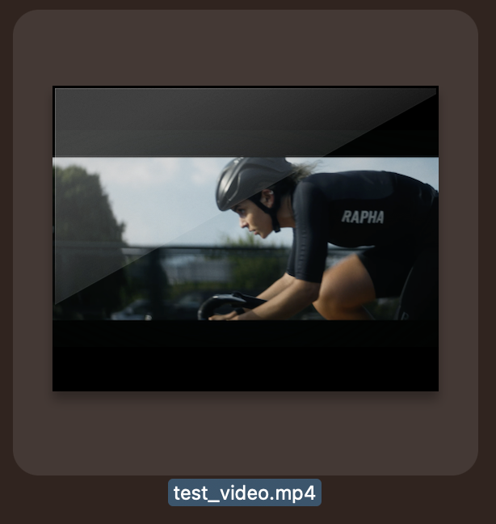
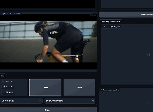
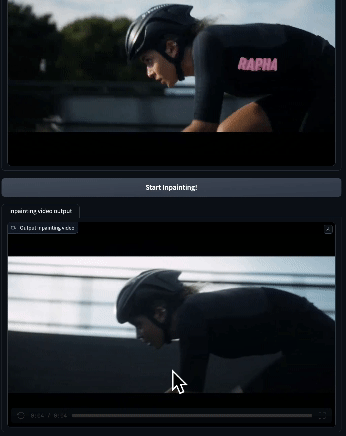

# Web UI Tutorial for Inpainting

## Prepare the video as input for the WebUI.
**The structure of _"test-video.mp4"_ must be like this :  
You need to edit and prepare your video so that the object or area you want to inpaint appears in the first frame.
If there are no objects or areas in the first frame that you want to inpaint, you won't be able to do so at this time.**

 

# Use WebUI get test_video data
## 1. Upload your video
Upload your video in one of the two ways 'A' or 'B' below.
### A. Drag a file into a block
 
 

### B. Click the block to upload a test video

 

## 2. Segment the area you want using SAM

Click with your mouse on the area you want to inpaint.  
The segment-anything model (called SAM) comes into play, automatically marking areas.  
Click the desired area as precisely as possible until all the desired areas are displayed.

In our example, we want to erase the logo, so we mark the logo on the clothing as an area.

 

We'll discuss specific parameter settings and buttons within the **Click tab** in more detail below.

 

## 3. Segment-and-Track-Anything using DeAOT
If you are satisfied with the segmented area in the first frame, click the **[Start Tracking!]** button. 

This will take the region in the first frame and automatically track it using the DeAOT model to display the region in the entire frame.
It then creates a video of the masked frames and previews them in the top right.
You can watch this video to see if the region is masked well.

 

## 4. Inpainting using E2FGVI
Check the masked video and if the area is well masked, press the **[start inpainting!]** button.

 

## 5. Download
You can download three materials here.
1. a masked (or segmented) video: _**test_video_seg1.mp4**_
2. a inpainting video: _**test_video_inpainting_h264.mp4**_
3. a compressed file of the masked frames of the video: _**test_video_pred_mask.zip**_
